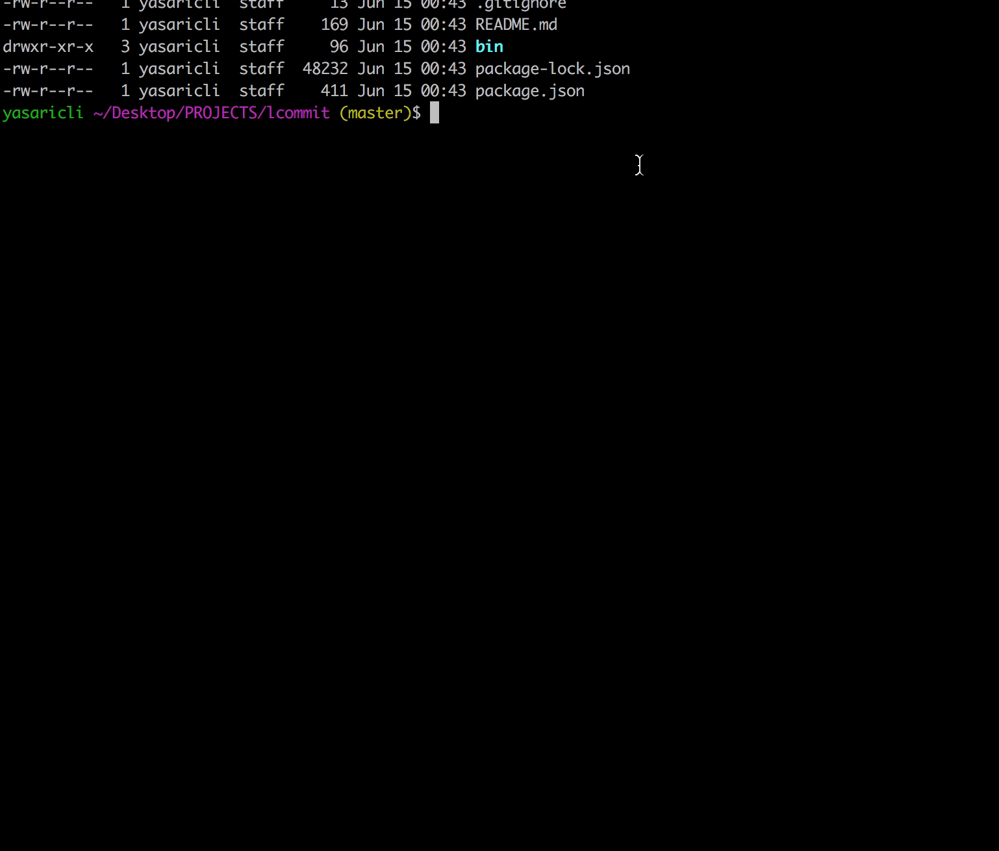

# lcommit
> Commit to the git location ;)

<div align="center">
  
</div>

## Install

```
$ npm install -g lcommit
```

## Usage

``` SH
lcommit --am "hello there." 
## region/city - hello there
```
